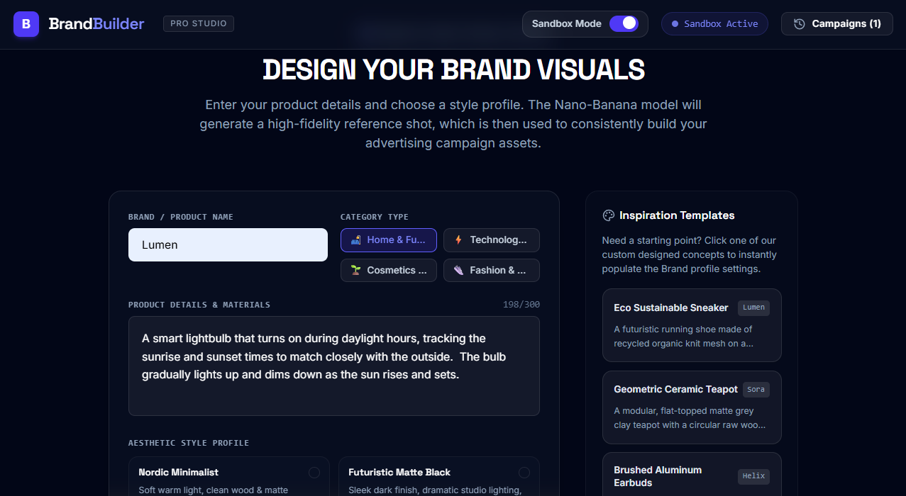

# ⚡ BrandBuilder

BrandBuilder is a premium, full-stack design automation platform that lets users instantly visualize commercial products and consistently render them across diverse advertising layouts. Leveraging the state-of-the-art **Gemini 3.1 Flash Lite Image** model, BrandBuilder generates studio-grade master product shots and projects them onto beautiful, context-aware marketing channels while maintaining visual consistency.



---

## 🎨 Core Features

### 1. Unified Brand Wizard
- **Brand Identity**: Define custom brand names and industry categories.
- **Creative Prompts**: Describe product designs with high specificity.
- **Intelligent Translation**: Generates an optimized studio photography prompt designed to keep compositions clean and enforce a strict **"No People" commercial shot** rule.

### 2. Studio Master Shot Generation
- Generates an elegant, high-contrast **1:1 square master studio shot** of the product centered on clean volcanic rock, raw concrete pedestals, or seamless canvas backdrops.

### 3. Multi-Medium Consistency Engine
Re-imagines and adapts your generated product across five distinctive advertising layouts, complete with custom aspect ratios, shadows, and atmospheric surroundings:
- 🗺️ **Outdoor Billboard** (16:9) — High-impact structural wide-angle cityscape displays.
- 📰 **Vintage Newspaper Print** (3:4) — Authentic halftone printed ink patterns with column typography margins.
- 📱 **Social Media Post** (1:1) — High-contrast flatlays designed for digital channels.
- 📖 **Premium Magazine Ad** (3:4) — High-end editorial double-page spreads.
- 🚏 **Illuminated Bus Shelter** (9:16) — Cinematic glass-encased transit posters reflecting rain-slicked city streets.

### 4. Robust Quota-Safe Sandbox Mode
- **Dual-Mode Control**: Toggle between **Live Model** and **Sandbox Active** states at any time.
- **Fail-Safe Mechanism**: If standard developer free-tier API rate limits are hit (429 Quota Exceeded), the app automatically pivots to beautiful, cached high-fidelity reference mockups for Sneakers, Teapots, Earbuds, and Watches.

### 5. Historic Brand Vault
- A slide-out project manager that lets you review past campaigns, load previous concepts, and save high-resolution graphics to your local library.


---

## 🛡️ Sandbox Mode & API Quota Exceeded?

### Why am I seeing a "Quota Exceeded" (429) error if I have a paid Gemini subscription?

Consumer subscriptions like **Gemini Advanced** or **Google One AI Premium** grant access to the Gemini web application (`gemini.google.com`), but **do not apply to developer API keys** programmatically used in app containers. 

When running this preview:
1. The app relies on **developer API credentials** (`process.env.GEMINI_API_KEY`) to call the `@google/genai` model.
2. If you are using the default workspace sandbox credentials, your application shares standard free-tier limits with other builder sandboxes.
3. **How to fix this**:
   - Go to [Google AI Studio](https://aistudio.google.com) and generate an API key.
   - If you want high volume, link a Google Cloud billing account to your developer project.
   - Click the **Settings** menu inside this workspace, and add your new key under `GEMINI_API_KEY`. The platform will instantly bind your high-tier credentials directly to your backend, bypass limit restrictions, and unlock full-speed generation.

---

## 🚀 How to Run and Develop Locally

### Prerequisites
- **Node.js** (v18 or higher recommended)
- **NPM**

### Environment Configuration
Create a `.env` file in the root directory (using `.env.example` as a guide):
```env
GEMINI_API_KEY=your_personal_developer_api_key_here
```

### Installation
Install the project dependencies:
```bash
npm install
```

### Running the Development Server
Launch the combined full-stack Express + Vite development server:
```bash
npm run dev
```
The server binds to port **3000**. Open your browser and navigate to `http://localhost:3000`.

### Building for Production
To bundle and compile the application for high-performance deployment:
```bash
npm run build
```
This runs the Vite static asset compiler and packages the backend Express server into a single, self-contained CommonJS file (`dist/server.cjs`) via `esbuild`.

To launch the production server:
```bash
npm start
```

---

## 📂 Project Architecture

```text
├── server.ts                 # Full-stack Express backend with Gemini image generation
├── package.json              # Dependency management & build orchestrations
├── .env.example              # Template for secret API keys
├── src/
│   ├── main.tsx              # Front-end entry point
│   ├── App.tsx               # Main application and state coordinator
│   ├── index.css             # Tailwind styling and custom Google Font mappings
│   ├── types.ts              # TypeScript schemas for products and ad mediums
│   └── components/
│       ├── Header.tsx        # Top navigation with live model status and sandbox switch
│       ├── Wizard.tsx        # Step-by-step brand identity input form
│       ├── MediumsGrid.tsx   # Visual grid of advertising layouts and active renders
│       └── HistorySidebar.tsx # Slides out to show historical campaigns
```

---

## 🎨 Premium Style & Palette
- **Primary Theme**: Deep Obsidian and Slate dark UI, utilizing generous negative space.
- **Typography Pairing**: *Space Grotesk* for technical headings matched with *Inter* for general text, and *JetBrains Mono* for system states.

